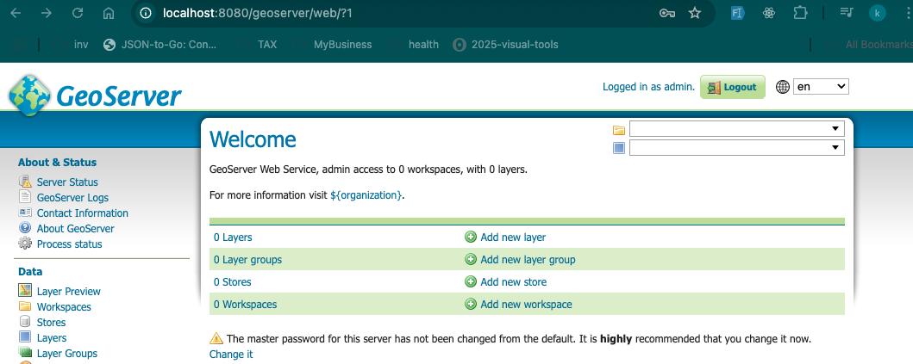
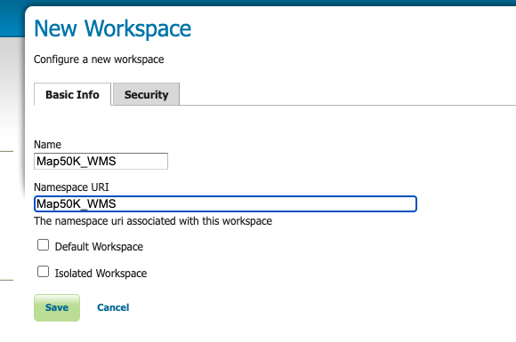
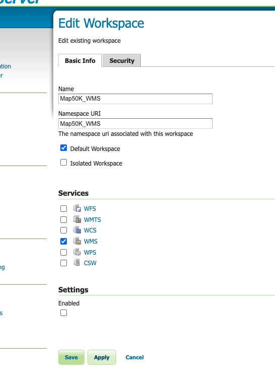
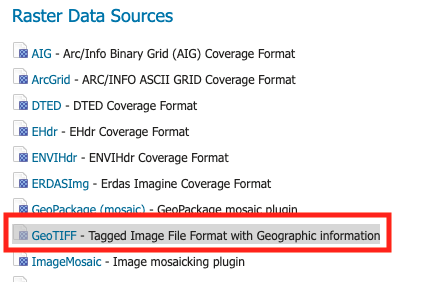

# Getting Started with Create React App

## Create project
```shell
npx create-react-app client
```

## Install lib list
```shell
npm i react-leaflet
npm i leaflet
npm i papaparse
npm i leaflet-rotatedmarker
npm i @turf/turf
```

## Base Map

- https://leaflet-extras.github.io/leaflet-providers/preview/

## Create Marker

- copy public/assets/air3.png to node_modules/leaflet/dist/images
- copy public/assets/fire.gif to node_modules/leaflet/dist/images/fire.gif

## Lib noted
- https://turfjs.org/


## Noted

### flight data
- You can use this find for upload the flight data `external-source/dump1090-127_0_0_1-170911.csv`

### iconAnchor
```js
let airMarker = L.icon({
    iconUrl: iconAir,
    shadowUrl: iconShadow,
    iconSize: [20, 25], // width, height in pixels
    iconAnchor: [10, 12.5] // anchor point relative to icon's top-left
});

```

- 'iconAnchor' In Leaflet, iconAnchor is a property of the L.Icon class that determines where the icon's "tip" or "anchor point" is positioned relative to its top-left corner. This property is crucial for properly positioning markers on the map.

## Location data
- https://github.com/prasertcbs/thailand_gis/tree/main/province
- https://github.com/prasertcbs/thailand_gis/blob/main/province/province_simplify.json
- Web สำหรับแปลงข้อมูล `https://geojson.io/#map=4.93/13.05/101.49`

## Change Icon
- https://www.flaticon.com/free-icon/map_717498?term=map&page=1&position=28&origin=search&related_id=717498

## Install Tailwind

### Install Tailwind CSS

```shell
npm install tailwindcss @tailwindcss/cli

```

```shell
## src/index.css

@import "tailwindcss";

```


```shell
# You need to run this command every time you code to generate and update the CSS.

npx @tailwindcss/cli -i ./src/index.css -o ./src/output.css --watch

```

```shell

## import './output.css';

import logo from './logo.svg';
import MapContent from './components/MapContent';
import './output.css';
import './App.css';

import 'leaflet/dist/leaflet.css';

function App() {
  return (
    <>
      <MapContent />
    </>
  );
}

export default App;


```

## Run GEO servier

```shell
docker compose -f geoserver/docker-compose.yml up -d

```
- access with http://localhost:8080/geoserver/web/?0 `user and password store on docker-compose file



### Create woekspace

- create workspace



- Click edit `Map50K_WMS`, and then select `WMS` on Services Sections



### Create new Store
Go to menu `Stores`

- Click `Add new Store` and select `GeoTIFF`




puza-th-01
p?c4bM_-Xb!Di%y


### Map datasource

https://gdcatalog.go.th/en/dataset/gdpublish-l7018

https://data.humdata.org/dataset/geoboundaries-admin-boundaries-for-thailand

https://data.opendevelopmentmekong.net/th/dataset/thailand-provincial-boundaries

https://github.com/cvibhagool/thailand-map

https://github.com/prasertcbs/thailand_gis


